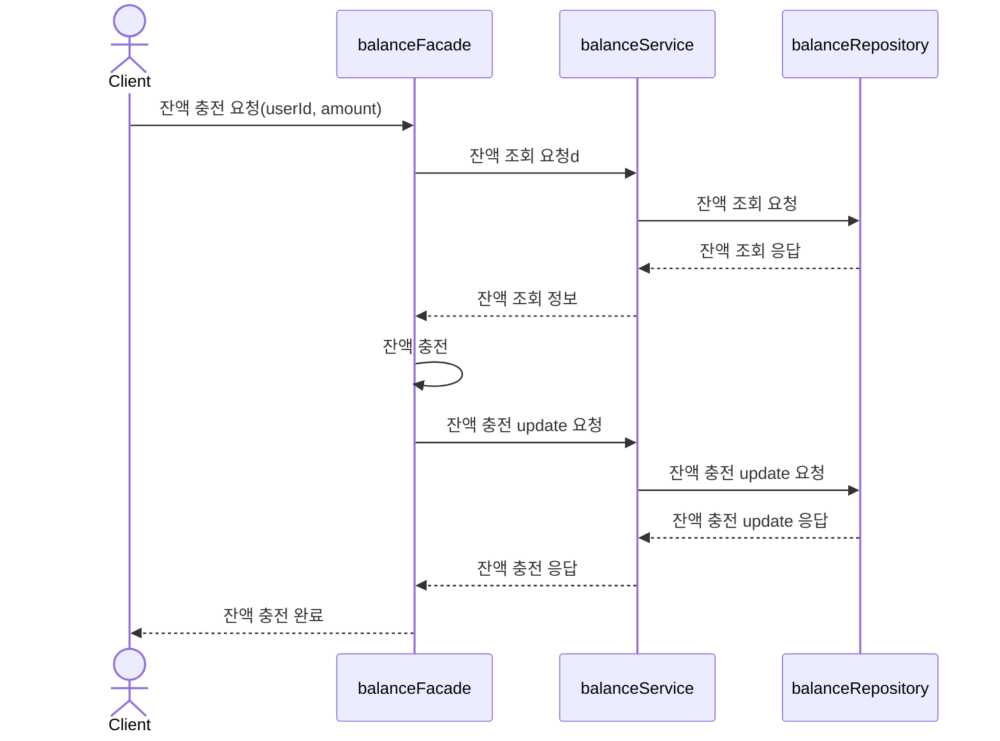
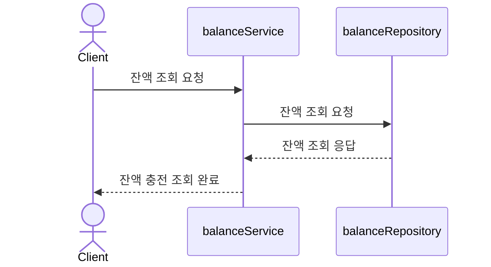
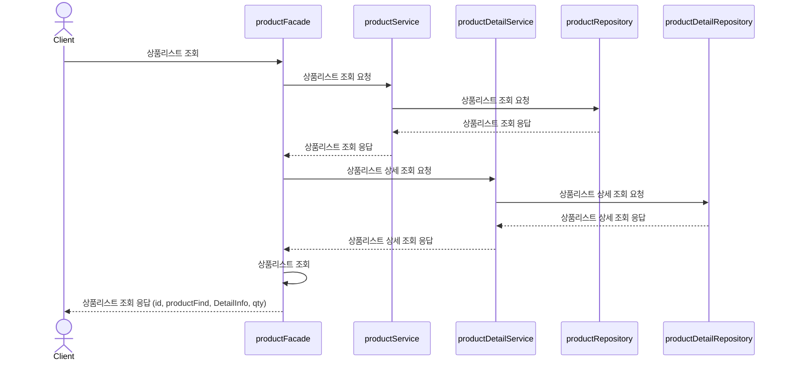
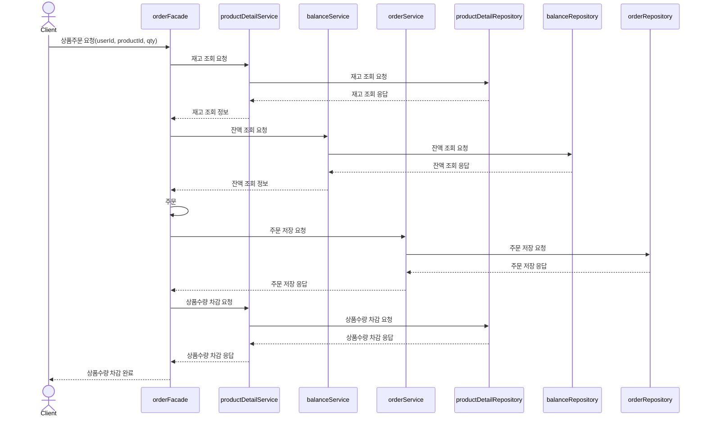
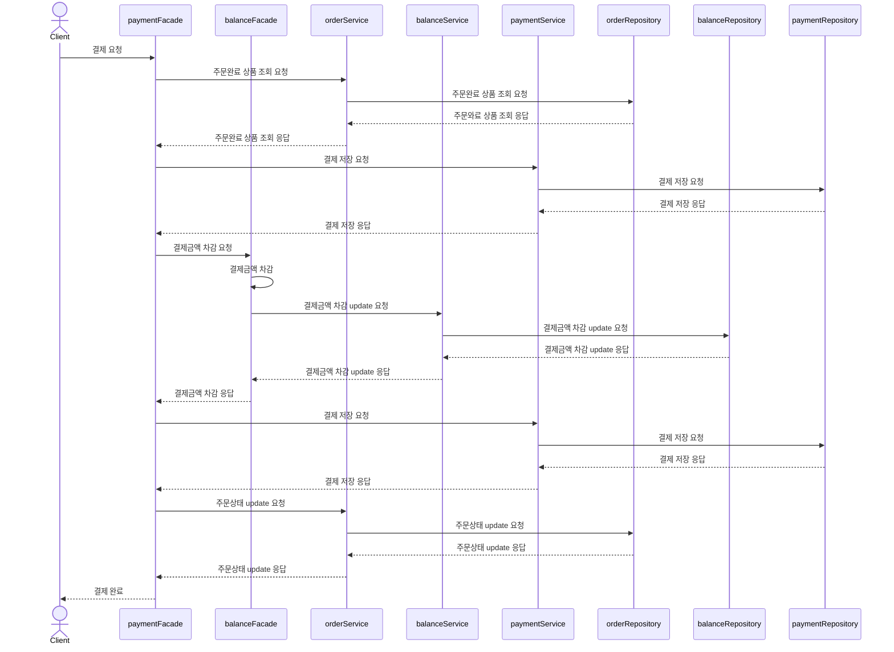
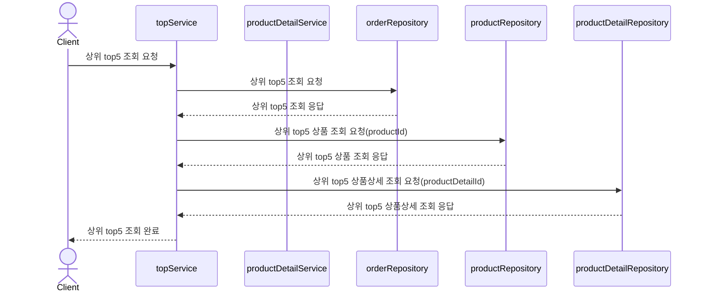
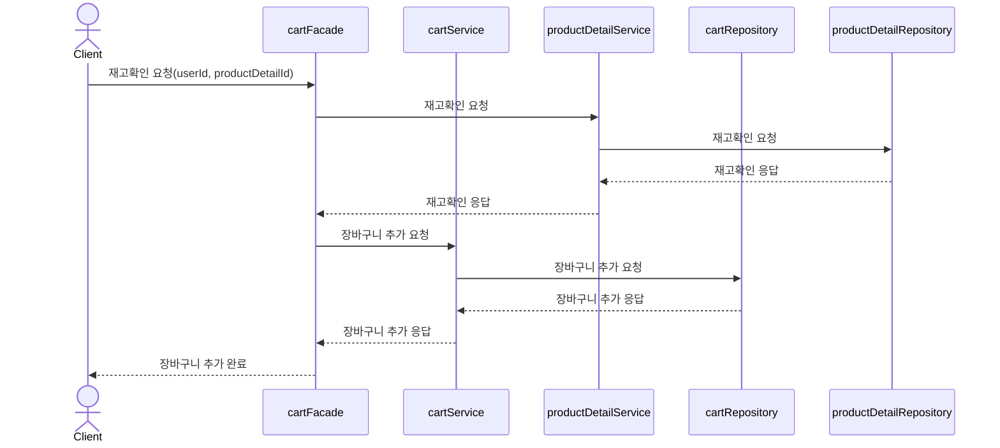
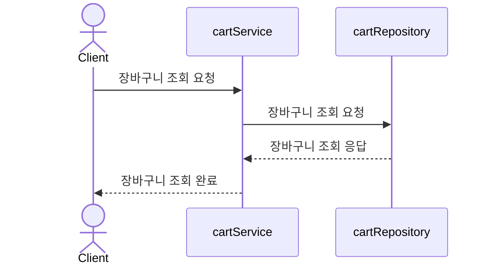

### 시퀀스 다이어그램
---
## 잔액 충전 API

```mermaid
sequenceDiagram
  actor Client 
  participant balanceFacade 
  participant balanceService 
  participant balanceRepository 

  Client ->> balanceFacade: 잔액 충전 요청(userId, amount)
  balanceFacade ->> balanceService: 잔액 조회 요청d
  balanceService ->> balanceRepository: 잔액 조회 요청
  balanceRepository -->> balanceService: 잔액 조회 응답
  balanceService -->> balanceFacade: 잔액 조회 정보
  balanceFacade ->> balanceFacade: 잔액 충전
  balanceFacade ->> balanceService: 잔액 충전 update 요청
  balanceService ->> balanceRepository: 잔액 충전 update 요청
  balanceRepository -->> balanceService: 잔액 충전 update 응답
  balanceService -->> balanceFacade: 잔액 충전 응답
  balanceFacade -->> Client: 잔액 충전 완료 
```
---
## 잔액조회 API

```mermaid
sequenceDiagram
  actor Client 
  participant balanceService 
  participant balanceRepository 

  Client ->> balanceService: 잔액 조회 요청
  balanceService ->> balanceRepository: 잔액 조회 요청
  balanceRepository -->> balanceService: 잔액 조회 응답
  balanceService -->> Client: 잔액 충전 조회 완료 
```
---
## 상품조회 API

```mermaid
sequenceDiagram
  actor Client
  participant productFacade
  participant productService
  participant productDetailService
  participant productRepository
  participant productDetailRepository

  Client ->> productFacade: 상품리스트 조회 
  productFacade ->> productService: 상품리스트 조회 요청
  productService ->> productRepository: 상품리스트 조회 요청
  productRepository -->> productService: 상품리스트 조회 응답
  productService -->> productFacade: 상품리스트 조회 응답 
  productFacade ->> productDetailService: 상품리스트 상세 조회 요청
  productDetailService ->> productDetailRepository: 상품리스트 상세 조회 요청
  productDetailRepository -->> productDetailService: 상품리스트 상세 조회 응답
  productDetailService -->> productFacade: 상품리스트 상세 조회 응답 
  productFacade ->> productFacade: 상품리스트 조회 
  productFacade -->> Client: 상품리스트 조회 응답 (id, productFind, DetailInfo, qty)
```
---
## 주문 API

```mermaid
sequenceDiagram
  actor Client
  participant orderFacade
  participant productDetailService
  participant balanceService
  participant orderService
  participant productDetailRepository
  participant balanceRepository
  participant orderRepository

  Client ->> orderFacade: 상품주문 요청(userId, productId, qty)
  orderFacade ->> productDetailService: 재고 조회 요청 
  productDetailService ->> productDetailRepository: 재고 조회 요청 
  productDetailRepository -->> productDetailService: 재고 조회 응답 
  productDetailService -->> orderFacade: 재고 조회 정보
  orderFacade ->> balanceService: 잔액 조회 요청
  balanceService ->> balanceRepository: 잔액 조회 요청
  balanceRepository -->> balanceService: 잔액 조회 응답
  balanceService -->> orderFacade: 잔액 조회 정보
  orderFacade ->> orderFacade: 주문
  orderFacade ->> orderService: 주문 저장 요청
  orderService ->> orderRepository: 주문 저장 요청 
  orderRepository -->> orderService: 주문 저장 응답
  orderService -->> orderFacade: 주문 저장 응답
  orderFacade ->> productDetailService: 상품수량 차감 요청
  productDetailService ->> productDetailRepository: 상품수량 차감 요청 
  productDetailRepository -->> productDetailService: 상품수량 차감 응답
  productDetailService -->> orderFacade: 상품수량 차감 응답
  orderFacade -->> Client: 상품수량 차감 완료
```
---
## 결제 API

```mermaid
sequenceDiagram
  actor Client
  participant paymentFacade
  participant balanceFacade
  participant orderService
  participant balanceService
  participant paymentService
  participant orderRepository
  participant balanceRepository
  participant paymentRepository

  Client ->> paymentFacade: 결제 요청
  paymentFacade ->> orderService: 주문완료 상품 조회 요청
  orderService ->> orderRepository: 주문완료 상품 조회 요청 
  orderRepository -->> orderService: 주문와료 상품 조회 응답
  orderService -->> paymentFacade: 주문완료 상품 조회 응답 
  paymentFacade ->> paymentService: 결제 저장 요청 
  paymentService ->> paymentRepository: 결제 저장 요청 
  paymentRepository -->> paymentService: 결제 저장 응답
  paymentService -->> paymentFacade: 결제 저장 응답
  paymentFacade ->> balanceFacade: 결제금액 차감 요청
  balanceFacade ->> balanceFacade: 결제금액 차감
  balanceFacade ->> balanceService: 결제금액 차감 update 요청 
  balanceService ->> balanceRepository: 결제금액 차감 update 요청
  balanceRepository -->> balanceService: 결제금액 차감 update 응답
  balanceService -->> balanceFacade: 결제금액 차감 update 응답
  balanceFacade -->> paymentFacade: 결제금액 차감 응답
  paymentFacade ->> paymentService: 결제 저장 요청
  paymentService ->> paymentRepository: 결제 저장 요청
  paymentRepository -->> paymentService: 결제 저장 응답
  paymentService -->> paymentFacade: 결제 저장 응답
  paymentFacade ->> orderService: 주문상태 update 요청
  orderService ->> orderRepository: 주문상태 update 요청
  orderRepository -->> orderService: 주문상태 update 응답
  orderService -->> paymentFacade: 주문상태 update 응답
  paymentFacade -->> Client: 결제 완료
```
---
## 상위 상품 조회 API

```mermaid
sequenceDiagram
  actor Client
  participant topService
  participant productDetailService
  participant orderRepository
  participant productRepository
  participant productDetailRepository

  Client ->> topService: 상위 top5 조회 요청 
  topService ->> orderRepository: 상위 top5 조회 요청 
  orderRepository -->> topService: 상위 top5 조회 응답
  topService ->> productRepository: 상위 top5 상품 조회 요청(productId)
  productRepository -->> topService: 상위 top5 상품 조회 응답
  topService ->> productDetailRepository: 상위 top5 상품상세 조회 요청(productDetailId)
  productDetailRepository -->> topService: 상위 top5 상품상세 조회 응답
  topService -->> Client: 상위 top5 조회 완료
```
---
## 장바구니 추가 API

```mermaid
sequenceDiagram
  actor Client
  participant cartFacade
  participant cartService
  participant productDetailService
  participant cartRepository
  participant productDetailRepository

  Client ->> cartFacade: 재고확인 요청(userId, productDetailId)
  cartFacade ->> productDetailService: 재고확인 요청 
  productDetailService ->> productDetailRepository: 재고확인 요청 
  productDetailRepository -->> productDetailService: 재고확인 응답
  productDetailService -->> cartFacade: 재고확인 응답
  cartFacade ->> cartService: 장바구니 추가 요청 
  cartService ->> cartRepository: 장바구니 추가 요청 
  cartRepository -->> cartService: 장바구니 추가 응답
  cartService -->> cartFacade: 장바구니 추가 응답
  cartFacade -->> Client: 장바구니 추가 완료
```
---
## 장바구니 삭제 API

```mermaid
sequenceDiagram
  actor Client
  participant cartService
  participant cartRepository

  Client ->> cartService: 장바구니 삭제 요청
  cartService ->> cartRepository: 장바구니 삭제 요청
  cartRepository -->> cartService: 장바구니 삭제 응답
  cartService -->> Client: 장바구니 삭제 완료
```
---
## 장바구니 조회 API

```mermaid
sequenceDiagram
  actor Client
  participant cartService
  participant cartRepository

  Client ->> cartService: 장바구니 조회 요청
  cartService ->> cartRepository: 장바구니 조회 요청
  cartRepository -->> cartService: 장바구니 조회 응답
  cartService -->> Client: 장바구니 조회 완료
```

