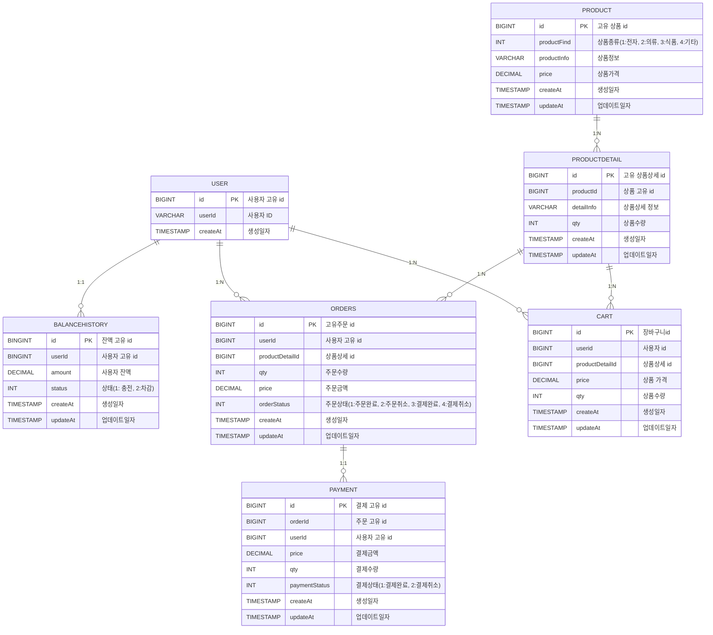

### ERD 설계
---

```mermaid

erDiagram
    USER ||--o{ BALANCEHISTORY : "1:1"
    USER ||--o{ ORDERS : "1:N"
    USER ||--o{ CART : "1:N"
    ORDERS ||--o{ PAYMENT : "1:1"
    PRODUCTDETAIL ||--o{ ORDERS : "1:N"
    PRODUCT ||--o{ PRODUCTDETAIL : "1:N"
    PRODUCTDETAIL ||--o{ CART : "1:N"

    USER {
        BIGINT      id      PK  "사용자 고유 id"
        VARCHAR     userId      "사용자 ID"
        TIMESTAMP createAt      "생성일자"
    }

    BALANCEHISTORY{
        BINGINT     id      PK  "잔액 고유 id"
        BINGINT     userId      "사용자 고유 id"
        DECIMAL     amount      "사용자 잔액"
        INT         status      "상태(1: 충전, 2:차감)"
        TIMESTAMP   createAt    "생성일자"
        TIMESTAMP   updateAt    "업데이트일자"
    }

    ORDERS {
        BIGINT      id              PK  "고유주문 id"
        BIGINT      userId              "사용자 고유 id"
        BIGINT      productDetailId     "상품상세 id"
        INT         qty                 "주문수량"
        DECIMAL     price               "주문금액"
        INT         orderStatus         "주문상태(1:주문완료, 2:주문취소, 3:결제완료, 4:결제취소)"
        TIMESTAMP   createAt            "생성일자"
        TIMESTAMP   updateAt            "업데이트일자"
    }
    PRODUCT {
        BIGINT      id          PK  "고유 상품 id"
        INT         productFind     "상품종류(1:전자, 2:의류, 3:식품, 4:기타)"
        VARCHAR     productInfo     "상품정보"
        DECIMAL     price           "상품가격"
        TIMESTAMP   createAt        "생성일자"
        TIMESTAMP   updateAt        "업데이트일자"
    }
    PRODUCTDETAIL {
        BIGINT      id         PK  "고유 상품상세 id"
        BIGINT      productId      "상품 고유 id"
        VARCHAR     detailInfo     "상품상세 정보"
        INT         qty            "상품수량"
        TIMESTAMP   createAt       "생성일자"
        TIMESTAMP   updateAt       "업데이트일자"
    }
    PAYMENT {
        BIGINT      id          PK  "결제 고유 id"
        BIGINT      orderId         "주문 고유 id"
        BIGINT      userId          "사용자 고유 id"
        DECIMAL     price           "결제금액"
        INT         qty             "결제수량"
        INT         paymentStatus   "결제상태(1:결제완료, 2:결제취소)"
        TIMESTAMP   createAt        "생성일자"
        TIMESTAMP   updateAt        "업데이트일자"
    }
    CART {
        BIGINT      id          PK  "장바구니id"
        BIGINT      userid          "사용자 id"
        BIGINT      productDetailId "상품상세 id"
        DECIMAL     price           "상품 가격"
        INT         qty             "상품수량"
        TIMESTAMP   createAt        "생성일자"
        TIMESTAMP   updateAt        "업데이트일자"
    }
```
